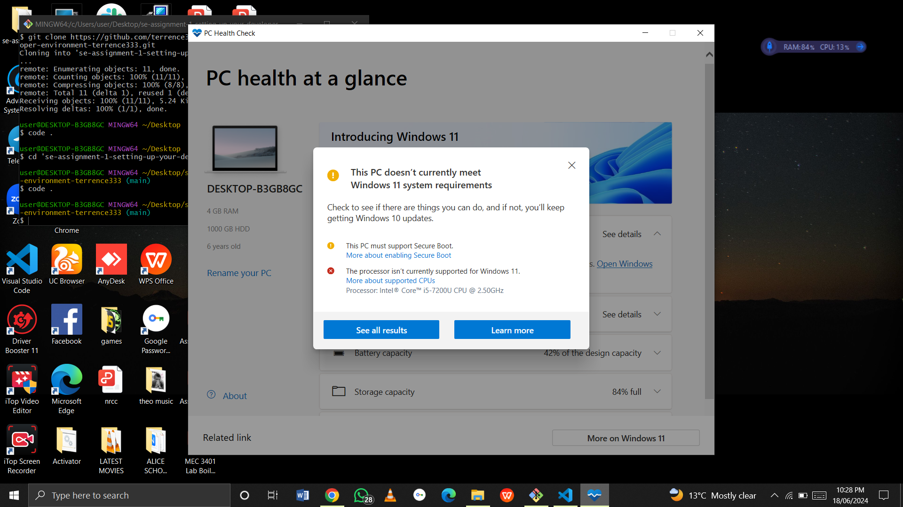
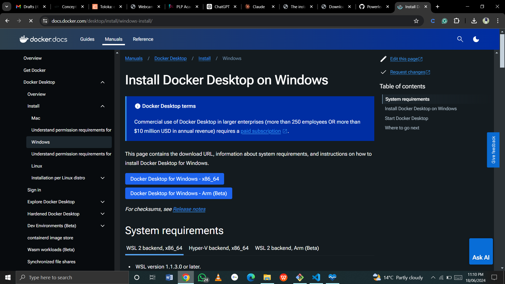

# Dev_Setup
Setup Development Environment

#Assignment: Setting Up Your Developer Environment

#Objective:
This assignment aims to familiarize you with the tools and configurations necessary to set up an efficient developer environment for software engineering projects. Completing this assignment will give you the skills required to set up a robust and productive workspace conducive to coding, debugging, version control, and collaboration.

#Tasks:

1. Select Your Operating System (OS):
   Choose an operating system that best suits your preferences and project requirements. Download and Install Windows 11. https://www.microsoft.com/software-download/windows11

Windows 11 Installation

Download Windows 11:

1-Visit the Windows 11 download page.

2-Click on "Download now" under the Windows 11 Installation Assistant.

3-Create Installation Media:

4-Run the downloaded Windows 11 Installation Assistant.

5-Follow the instructions to create a bootable USB drive. You will need a USB drive with at least 8GB of space.

6-Install Windows 11:

7-Insert the USB drive into the computer where you want to install Windows 11.

8-Restart the computer and boot from the USB drive (you may need to change the boot order in the BIOS/UEFI settings).

9-Follow the on-screen instructions to install Windows 11.

2. Install a Text Editor or Integrated Development Environment (IDE):
   Select and install a text editor or IDE suitable for your programming languages and workflow. Download and Install Visual Studio Code. https://code.visualstudio.com/Download

Visual Studio Code (VS Code) Installation

Download Visual Studio Code:

1-Visit the Visual Studio Code download page.

2-Select the appropriate version for Windows and download the installer.

3-Install Visual Studio Code:

4-Run the downloaded installer.

5-Follow the installation wizard:

6-Accept the agreement.

7-Choose the installation location.

8-Select additional tasks (e.g., creating a desktop icon, adding to PATH).

9-Click "Install" to complete the setup.

3. Set Up Version Control System:
   Install Git and configure it on your local machine. Create a GitHub account for hosting your repositories. Initialize a Git repository for your project and make your first commit. https://github.com

Download and Install Git:

1-Visit the Git download page.

2-Download the Git installer for Windows.

3-Run the Git Installer:

4-Execute the downloaded installer.

5-Follow the installation steps:

6-Choose the installation location.

7-Select components (use the default settings).

8-Choose the default editor used by Git (e.g., Vim, Notepad++, VS Code).

9-Adjust the name of the initial branch in new repositories.

10-Choose the HTTPS transport backend.

11-Configure the line ending conversions.

12-Choose the terminal emulator to use with Git Bash.

13-Choose the default behavior of Git Pull.

14-Enable/disable extra features (e.g., credential manager, symbolic links).

15-Click "Install" to complete the setup.

16-Configure Git:

-Open Git Bash.

-Set your username and email:

=bash

-git config --global user.name "Your Name"

-git config --global user.email "your.email@example.com"

-Create a GitHub Account:

-Visit GitHub and click "Sign up".

-Follow the registration steps to create a new account.

-Initialize a Git Repository:

-Create a new directory for your project and navigate into it:

-bash

-mkdir my_project

-cd my_project

-Initialize a Git repository:

bash

-git init

-Make your first commit:

bash

-echo "# My Project" > README.md

-git add README.md

-git commit -m "Initial commit"

-Push to GitHub:

-Create a new repository on GitHub.

-Link your local repository to GitHub:

bash

-git remote add origin https://github.com/yourusername/my_project.git

-git branch -M main

-git push -u origin main

4. Install Necessary Programming Languages and Runtimes:
  Instal Python from http://wwww.python.org programming language required for your project and install their respective compilers, interpreters, or runtimes. Ensure you have the necessary tools to build and execute your code.

Python Installation

Download Python:

1-Visit the Python download page.

2-Download the latest version of Python for Windows.

3-Install Python:

4-Run the downloaded installer.

5-Ensure "Add Python to PATH" is checked.

6-Click "Install Now" and follow the installation wizard.

7-Verify Python Installation:

8-Open Command Prompt or PowerShell.

9-Verify the installation:

-bash

10-python --version

pip --version

5. Install Package Managers:

   If applicable, install package managers like pip (Python).

pip Installation

pip is installed automatically with Python. 

-On windows , press the windows key and serach for command prompt or powershell. open it.

-Then type python3 get - pip.py

-Verify by typing pip --version

6. Configure a Database (MySQL):
   Download and install MySQL database. https://dev.mysql.com/downloads/windows/installer/5.7.html
MySQL Installation

Download MySQL:

1-Visit the MySQL download page.

2-Download the MySQL Installer for Windows.

3-Run the MySQL Installer:

4-Execute the downloaded installer.

5-Choose the "Developer Default" setup type.

6-Follow the installation steps, including:

7-Choosing the installation location.

8-Selecting MySQL products to install.

9-Configuring the MySQL server (e.g., root password, user accounts).

10-Starting the MySQL server.

-Verify MySQL Installation:

-Open the MySQL Command Line Client.

-Verify the installation by logging in with the root user and executing a simple command:
sql

-SHOW DATABASES;

7. Set Up Development Environments and Virtualization (Optional):
   Consider using virtualization tools like Docker or virtual machines to isolate project dependencies and ensure consistent environments across different machines.
-Docker Installation (Optional)

Download Docker Desktop:

Visit the Docker download page.

Download Docker Desktop for Windows.

Install Docker Desktop:

1-Download the installer using the download button at the top of the page, or from the release notes.

2-Double-click Docker Desktop Installer.exe to run the installer. By default, Docker Desktop is installed at C:\Program Files\Docker\Docker.

3-When prompted, ensure the Use WSL 2 instead of Hyper-V option on the Configuration page is selected or not depending on your choice of backend.

4-If your system only supports one of the two options, you will not be able to select which backend to use.

5-Follow the instructions on the installation wizard to authorize the installer and proceed with the install.

6-When the installation is successful, select Close to complete the installation process.

-If your admin account is different to your user account, you must add the user to the docker-users group:

1-Run Computer Management as an administrator.

2-Navigate to Local Users and Groups > Groups > docker-users.

3-Right-click to add the user to the group.

4-Sign out and sign back in for the changes to take effect.

-Verify Docker Installation:

-Open Command Prompt or PowerShell.

-Verify the installation:

bash

-docker --version

8. Explore Extensions and Plugins:
   Explore available extensions, plugins, and add-ons for your chosen text editor or IDE to enhance functionality, such as syntax highlighting, linting, code formatting, and version control integration.

-Recommended VS Code Extensions

-Python: Provides rich support for Python development.

-Install via VS Code Marketplace or directly in VS Code:
bash

-code --install-extension ms-python.python

-GitLens: Enhances Git capabilities within VS Code.

-Install via VS Code Marketplace or directly in VS Code:
bash

-code --install-extension eamodio.gitlens

-Prettier: Code formatter for consistent code style.

-Install via VS Code Marketplace or directly in VS Code:
bash

-code --install-extension esbenp.prettier-vscode
-ESLint: Linting support for JavaScript and TypeScript.

-Install via VS Code Marketplace or directly in VS Code:
bash

-code --install-extension dbaeumer.vscode-eslint

9. Document Your Setup:
    Create a comprehensive document outlining the steps you've taken to set up your developer environment. Include any configurations, customizations, or troubleshooting steps encountered during the process. 
Setup Documentation

Steps Taken: Detailed above.

Configurations:

-Git configured with username and email.

-Python added to PATH.

-Customizations: Installed VS Code extensions for enhanced functionality.

--Troubleshooting Steps:

-Encountered issues with Windows 11 installation , so did not install it as the PC is not compatible

-Encountered issues with Git installation resolved by reinstalling with administrator privileges.

-Python PATH issues resolved by modifying system environment variables.

#Deliverables:

=Windows 11 Installation:

-Challenge: Computer does not meet the requirements to install windows 11

=GitHub Repository: Sample Project Repository containing the initial commit and configuration files.

Reflection on Challenges:

-Challenge: Git installation issues due to permissions.

-Solution: Reinstalled Git with administrator privileges.

-Challenge: Python not recognized in PATH.

-Solution: Manually added Python to system environment variables.

